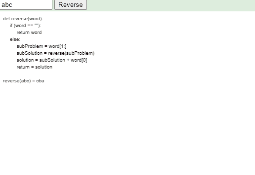

## Introduction to Recursion

Recursion is a powerful problem-solving technique where a function calls itself to solve smaller instances of the same problem. It's a fundamental concept in computer science and is widely used in various programming tasks.

### How Recursion Works

In a recursive function, the problem is divided into smaller subproblems that are similar in structure to the original problem. The function then calls itself to solve each subproblem. This process continues until a base case is reached, where the function doesn't make any further recursive calls. The base case(s) are essential to prevent infinite recursion and ensure the function terminates.

### Key Components of Recursion

1. **Base Case:** This is the termination condition for the recursive calls. When the base case is met, the function stops making further recursive calls and starts returning results back to the previous calls.

2. **Recursive Call:** Within the function, there will be one or more calls to the same function with modified arguments to solve the smaller subproblems.

## Advantages and Caveats

Recursion can lead to elegant and concise code solutions for certain problems, especially those with repetitive structures. However, improper use of recursion or lack of proper base cases can result in stack overflow errors and inefficient solutions.

## When to Use Recursion

Recursion is suitable for problems that can be broken down into smaller, similar subproblems and when a divide-and-conquer approach seems appropriate. For some problems, an iterative solution might be more efficient, so it's essential to consider the trade-offs before opting for recursion.

For example, consider a function that calculates the factorial of a number. The factorial of a number is the product of all the integers from 1 up to that number. For example, the factorial of 5 is 1 * 2 * 3 * 4 * 5 = 120.

```
function factorial(n: number): number {
    if (n == 1) {
        return 1; // base case
    }

    return n * factorial(n - 1); // recursive call
}
```

Another Example to Reverse given word recursively:

